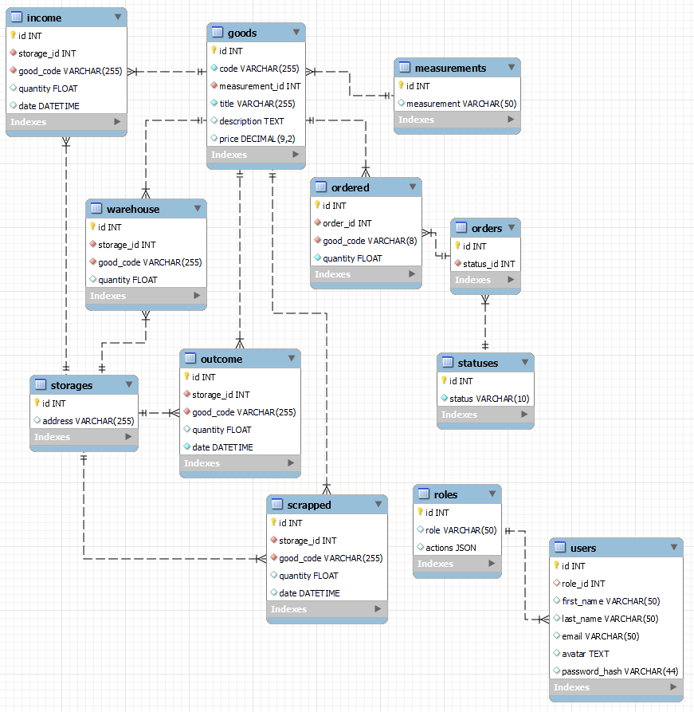
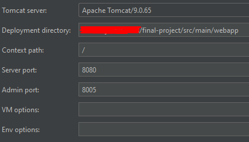

PROJECT DESCRIPTION
--

## The cash register

### Roles:
1. cashier
2. senior cashier
3. commodity expert
4. admin

### The cashier can:
1. create order
2. add goods to order (by goods code or title)
3. update goods ordered quantity 
4. close order
5. get list of all orders

### The senior cashier can:
1. create X-Report
2. create Z-Report
3. cancel order
4. cancel ordered goods

### The commodity expert can:
1. create goods
2. update goods
3. add goods to the storage
4. write off the goods
5. get list of goods
6. get list of all goods in stock

## Project dependencies
all project dependencies are in pom.xml file.

## Project Database
Project use MySQL database.
To create project db you should run create_cash_register_db_script.sql that located in the resources folder.

## Project Settings
All project settings are stored in property files witch located in the resources folder.

## Smart Tomcat config

